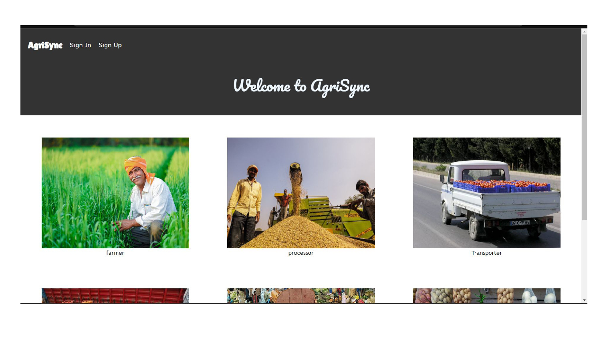
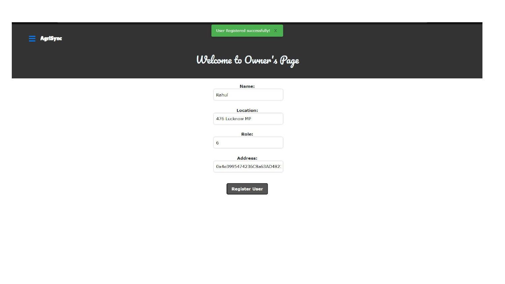
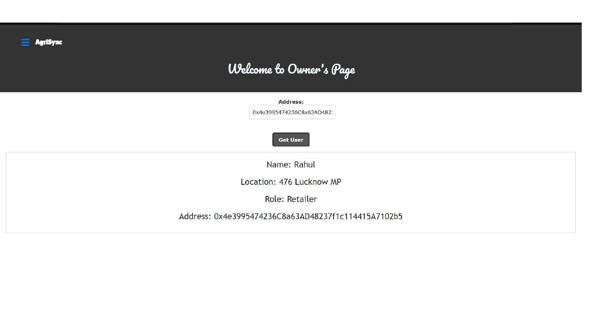
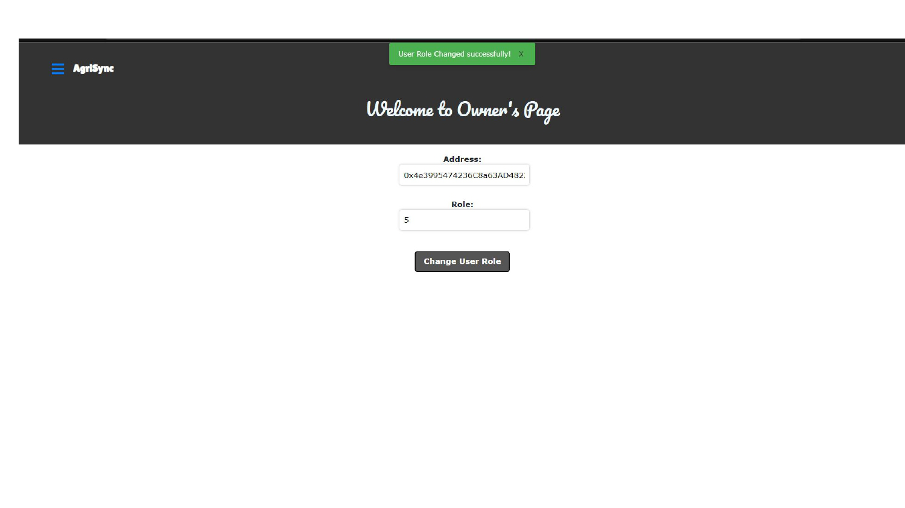
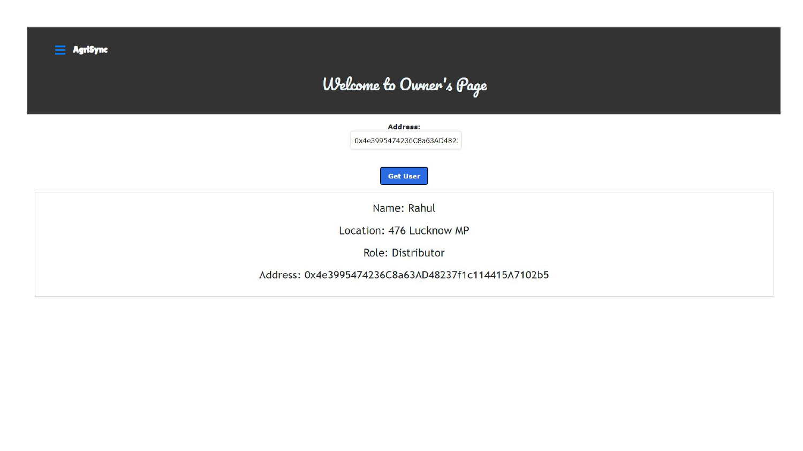
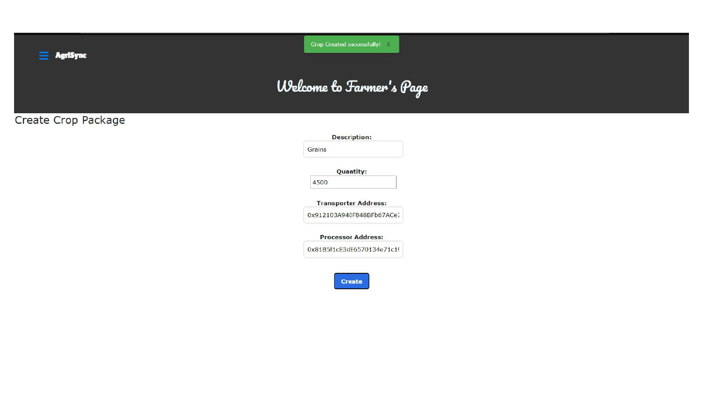
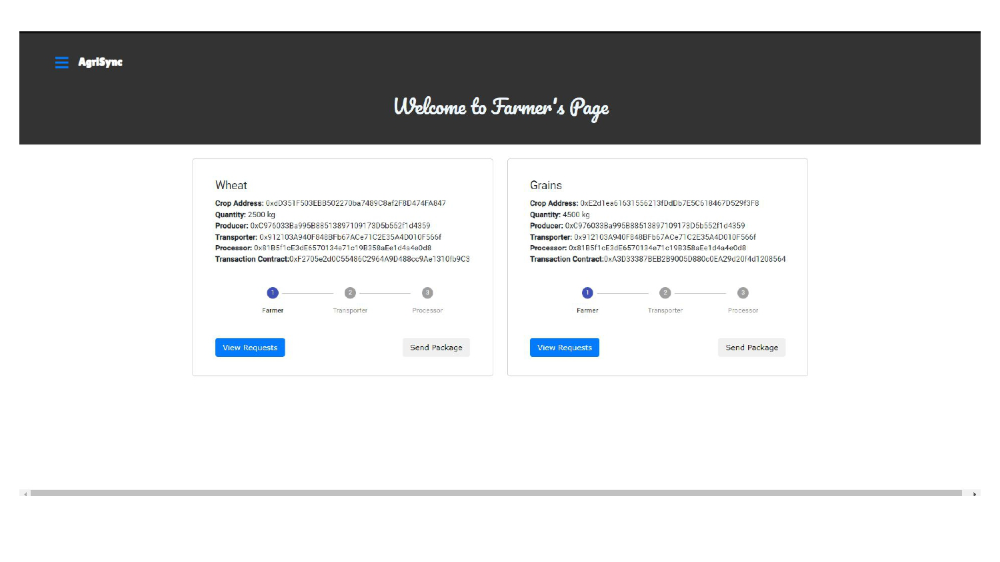

# Project Name

## Description

This project is a decentralized application (DApp) that combines a React frontend, a Node.js backend, and smart contracts written in Solidity. It aims to provide a decentralized solution for Application of Blockchain-based supply chain management in Agriculture.

## Project Structure

The project structure is organized as follows:

```
- client/          (React frontend)
  - src/
    - components/  (React components)
    - styles/      (CSS stylesheets)
  - package.json   (frontend dependencies and scripts)

- src/             (Node.js backend)
  - controllers/   (backend logic)
  - routes/        (API routes)
  - package.json   (backend dependencies and scripts)

- contracts/       (Solidity smart contracts)
  - Supplychain.sol

- README.md        (Project documentation)
```

## Installation

To install and run this project on your local machine, follow these steps:

### Prerequisites

- Node.js (v12.0 or higher)
- npm (Node Package Manager)
- Truffle (Solidity development environment)

### Clone the repository

```
git clone <repository_url>
cd <project_directory>
```

### Frontend Setup

1. Navigate to the `client` folder:
   ```
   cd client
   ```

2. Install frontend dependencies:
   ```
   npm install
   ```

### Backend Setup

1. Navigate to the `src` folder:
   ```
   cd ../src
   ```

2. Install backend dependencies:
   ```
   npm install
   ```

### Smart Contracts Setup

1. Navigate to the `contracts` folder:
   ```
   cd ../contracts
   ```

2. Compile the Solidity smart contracts:
   ```
   truffle compile
   ```
3. Migrate Solidity smart contracts:
   ```
   truffle migrate
   ```

### Run the Application

1. Start the backend server:
   ```
   cd ../src
   npm start
   ```

2. In a separate terminal, start the frontend development server:
   ```
   cd ../client
   npm start
   ```

3. Access the application by opening your web browser and visiting `http://localhost:3000`.

## Usage
















## Contributing

Contributions to this project are welcome! To contribute, please follow these steps:

1. Fork the repository and create a new branch.
2. Make your changes or additions to the codebase.
3. Ensure that your code follows the project's coding style and conventions.
4. Test your changes to make sure they work as intended.
5. Commit your changes and push them to your forked repository.
6. Open a pull request on the main repository and provide a clear and descriptive explanation of your changes.

All pull requests will be reviewed by the project maintainers. Constructive feedback and suggestions may be provided to further improve the contribution.

## Contact

[Connect on LinkedIn](https://www.linkedin.com/in/charan-kannati)

<table>
  <tr>
    <td align="center"><a href="https://github.com/charankannati"><br /><sub><b>Charan Kannati</b></sub></a><br /><a href="" title="">:new_moon_with_face:</a></td>
  </tr>
 </table>

## Acknowledgments

We would like to express our gratitude to the following resources, libraries, and individuals who have inspired or assisted us throughout the development of this project:

- Dr.Chayadevi ML: We would like to extend our appreciation to her for their insightful feedback and suggestions during the project review and testing phase.

- Open-source community: We are thankful to the vibrant open-source community for creating and maintaining numerous tools and frameworks that significantly facilitated our development process.

- Stack Overflow contributors: We would like to acknowledge the Stack Overflow community for their prompt and helpful responses to our technical questions throughout the project.

We are grateful for the contributions of all these resources, libraries, and individuals, as they played a crucial role in shaping the success of our project.


